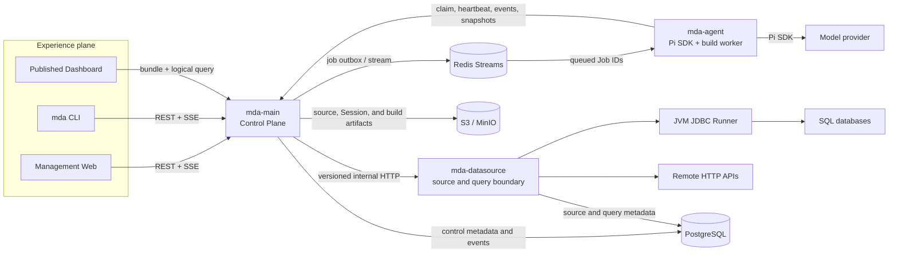
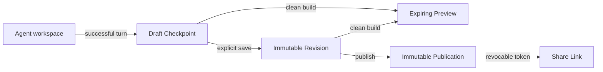

# MDA Technical Architecture

This note is the architectural map of MDA: why the system exists, the ideas that shape it, its major technical boundaries, and the principal data flows. Endpoint, schema, and operational details live in the linked module documents.

## Background

Conventional dashboard builders gain predictability by limiting users to a component catalog or UI schema. That makes common pages easy to assemble, but every new interaction, visual form, or page structure must first become a platform feature.

MDA chooses a different product model: a Coding Agent works on an ordinary TypeScript project. The user describes an outcome, the Agent inspects data and source, edits files, builds a Preview, and continues refining the same project through conversation. Source code—not a generated component tree—is the durable product artifact.

A Coding Agent alone is not a safe management system. It should not own identity, credentials, durable state, publishing, or runtime data access. MDA therefore places the Agent inside a managed architecture that preserves creative freedom while enforcing operational boundaries around it.

## Design philosophy

1. **Constrain capabilities, not presentation.** The platform controls files, dependencies, credentials, queries, builds, and delivery. The Agent controls components, layout, styling, interactions, and source organization.
2. **Code is the canonical artifact.** `src/**`, `public/**`, and a small external Manifest remain inspectable, exportable, and editable with normal developer tools. MDA does not round-trip source through a proprietary UI DSL.
3. **The Agent authors; it does not serve.** Pi participates in design and modification. Published dashboards render and refresh without invoking a model or Agent Job.
4. **Immutable code, live data.** Revisions and Publications pin source, build output, and Query Revisions. Runtime queries still read current authorized source rows.
5. **Soft guidance, hard boundaries.** Reviewed Skills guide requirements, visualization, design, engineering, and testing. Versioned Tools and service APIs enforce what the Agent can actually do.
6. **Durable truth before fast coordination.** PostgreSQL is authoritative. Redis transports work and reduces coordination latency; losing Redis must not erase domain state or event history.
7. **Pragmatic separation.** MDA uses a few process boundaries where security or ownership demands them, while keeping the dependency set and in-process abstractions small.

## Core concepts

| Concept | Meaning |
|---|---|
| **Dashboard** | Stable project identity and metadata. |
| **Agent Session / Job** | A Session preserves one conversation; a Job is one leased turn or model-free build operation. |
| **Draft Checkpoint** | Automatic, recoverable source snapshot after successful Agent work. |
| **Dashboard Revision** | Explicitly saved, immutable source snapshot. |
| **Preview** | Expiring, isolated build of a Checkpoint or Revision. |
| **Publication / Share Link** | Immutable release of one Revision and a revocable access policy pointing to it. |
| **Data Source / Query Revision** | Server-side connection and an immutable, validated read-only operation. Publications pin Query Revisions, never raw SQL or credentials. |

The Manifest is deliberately narrow. It declares the source entry, Runtime version, and Query dependencies; it does not describe components, charts, controls, or layout.

## Logical architecture

Only `mda-main` is exposed to clients. The Agent reaches data capabilities through lease-authorized Control Plane APIs and never receives Data Source credentials. The Data Source Service is the only Bun service that resolves source secret references; JDBC credentials are passed only to the isolated Runner for the request.

## Major components

| Component | Responsibility |
|---|---|
| `apps/web` | React management workspace for conversation, source history, Previews, Publications, sharing, Data Sources, Queries, and Jobs. |
| `apps/cli` | Scriptable and interactive client of the same public Control Plane API; it contains no business or persistence logic. |
| `apps/control-plane` | Authentication, tenant context, Dashboard lifecycle, Agent Job authority, durable events, artifacts, publishing, sharing, and public delivery. |
| `apps/agent` | Redis consumer pool, fenced Job execution, Pi Sessions, reviewed Skills and Tools, isolated Session workspaces, and clean dashboard builds. |
| `apps/data-source-service` | Data Source lifecycle, secret resolution, HTTP/JDBC connectors, immutable registered Queries, bounded execution, and audit. |
| `connectors/jdbc-runner` | Small Java boundary for allowlisted JDBC drivers and read-only parameterized SQL. |
| `packages/contracts` | TypeBox transport schemas shared across process boundaries. It contains no domain logic or infrastructure access. |
| `packages/dashboard-template` | Platform-owned Vite build shell, approved dependencies, validation, and immutable bundle creation. |
| `packages/dashboard-runtime` | Browser API for `dashboard.query()` and `dashboard.watch()` without exposing SQL or credentials. |

### Technology baseline

- TypeScript and Bun `1.3.14` for services, CLI, contracts, builds, and tests.
- React `19` and Vite `8` for the management UI and generated dashboards.
- Pi Coding Agent SDK `0.84.2` for direct, resumable Agent sessions.
- PostgreSQL `17` for authoritative state and ordered event history.
- Redis `7` Streams for Agent Job delivery.
- S3-compatible storage, provided by MinIO in Compose, for immutable source, Session, Preview, and Publication artifacts.
- Java `21` only at the JDBC interoperability boundary.
- Docker Compose for the current single-host deployment.

## Data flow

### 1. Conversational authoring

1. Web or CLI submits a message to the Control Plane.
2. The Control Plane creates the Agent Job and outbox record in one PostgreSQL transaction.
3. The dispatcher appends only routing identifiers to a Redis Stream.
4. An Agent worker claims the Job through the Control Plane and receives a time-limited lease with a fencing token.
5. The worker restores the latest source Checkpoint and Pi Session history through the Control Plane, then runs Pi in that Session's workspace.
6. Pi may edit ordinary source, build it, or call credential-free Data Tools. Data calls travel back through the Control Plane to the Data Source Service.
7. Agent output and Tool/build state become ordered PostgreSQL events and stream to clients over resumable SSE.
8. On success, the worker sends bounded source and Session artifacts to the Control Plane, which stores them in Object Storage and settles the Job. Stale workers cannot commit after losing their lease.

### 2. Source and release lifecycle

Dedicated Preview and Publication Jobs run in `mda-agent` without invoking the model; the same builder is also available to Pi as a validation Tool during authoring. The build shell accepts only the Manifest, `src/**`, and `public/**`; validates approved imports and network boundaries; runs Vite in a fresh temporary directory; and returns a content-addressed bundle. `mda-main` stores and serves the bundle but never executes generated source.

### 3. Live dashboard query

1. Generated code calls `dashboard.query(logicalName, parameters)` or starts a `dashboard.watch(...)` poller.
2. The request goes to the Share Link path on `mda-main`; the browser provides neither a tenant ID, Data Source ID, Query Revision, SQL, nor credentials.
3. The Control Plane validates the link and immutable Publication binding, then asks `mda-datasource` to execute the exact pinned Query Revision.
4. The Data Source Service validates typed parameters and source state, resolves secrets internally, and delegates to the HTTP connector or JDBC Runner.
5. Presentation-neutral rows and freshness metadata return to generated source.

This path contains no Pi call, source mutation, build, or new Revision. A source-row change can therefore appear on the next refresh while the published frontend remains byte-for-byte immutable.

## State ownership and trust boundaries

| Owner | Authoritative state |
|---|---|
| Control Plane PostgreSQL tables | Tenants, Dashboards, folders, Sessions, Jobs, events, Checkpoints, Revisions, Previews, Publications, Query bindings, and Share Links. |
| Data Source PostgreSQL tables | Sources, Config and Schema Revisions, registered Queries, execution audit, and source events. |
| Object Storage | Immutable source snapshots, Pi Session JSONL, Preview bundles, and Publication bundles; PostgreSQL stores their verified references and digests. |
| Redis | Delivery and coordination only. It is not the sole copy of a Job, event, or artifact. |
| Agent workspace | Temporary execution state for one Session; it becomes durable only through a fenced Checkpoint or Session artifact upload. |

Important boundaries:

- Clients use public Control Plane contracts; they never connect directly to PostgreSQL, Redis, Object Storage, Pi, or a connector.
- `mda-main` does not execute generated code or resolve Data Source secrets.
- `mda-agent` has no PostgreSQL, Object Storage, or Data Source credential.
- `mda-datasource` does not read Dashboard source or Control Plane tables.
- Preview and shared pages receive restrictive CSP, sandboxing, normalized paths, and no management credentials.
- Process boundaries share schemas through `packages/contracts`, not database modules or domain internals.

## Current implementation boundary

The current tree implements the principal vertical slice above. A few hardening and expansion points remain explicit rather than hidden:

- Control Plane and Data Source migrations are independently owned, but Compose currently uses the same PostgreSQL database and administrative role; separate roles or schemas remain to be completed.
- Session directories and containers prevent accidental overlap, but the single-host Agent pool is not yet a hostile multi-tenant sandbox.
- Live Runtime queries currently use same-origin public Share Links and only Query Revisions explicitly approved for public execution. An authenticated Viewer Host bridge and snapshot sharing are later work.
- Redis delivers and reclaims Jobs; cancellation checks and SSE event discovery still use bounded PostgreSQL polling in places.
- Forked Agent Tasks are a proposal, not part of the running architecture.

## Related design documents

- [Why MDA Uses a Coding Agent Instead of GenUI](why-coding-agent-instead-of-genui.md)
- [Domain-Driven Design Structure](domain-driven-design-structure.md)
- [Dashboard Artifact Contract](dashboard-artifact-contract.md)
- [Data Gateway and Data Source Contract](data-gateway-query-contract.md)
- [Live Data, Saving, and Refresh Contract](live-data-and-refresh-contract.md)
- [Dashboard Skill System](dashboard-skills/skill-system.md)
- [Docker Compose Deployment Architecture](docker-compose-deployment-architecture.md)
- [MDA CLI Design](mda-cli-design.md)
